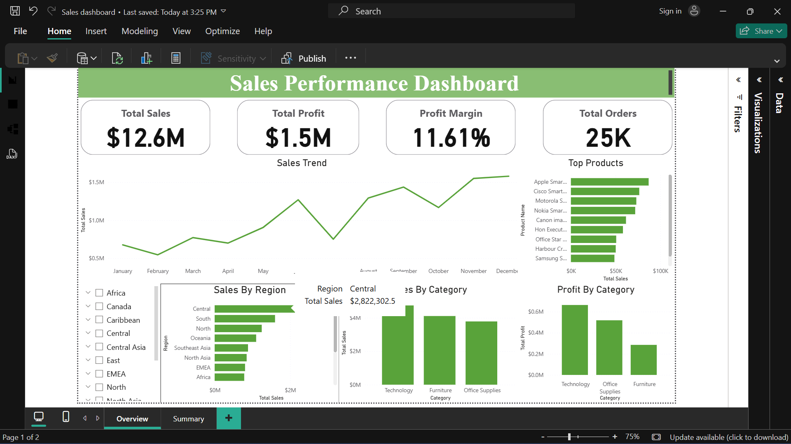

# 📊 sales-performance-dashboard
Power BI dashboard analyzing sales performance, profitability, and business trends using a global retail dataset.
# 🛠️ Tools Used
- Power BI
- Power Query
- DAX
# 📈 Key Features
- KPI tracking (Sales, Profit, Profit Margin, Orders)
- Sales trend analysis over time
- Regional and category performance insights
- Top-performing products analysis
- Interactive filters (slicers)
# 🧠 Key Insights
- The business generated $12.6M in sales and $1.5M in profit
- Sales show a steady upward trend over time
- Some categories have high sales but lower profit margins
- A small number of products contribute significantly to revenue
# 🎯 Business Recommendations
- Focus on high-margin products
- Optimize discount strategies
- Improve underperforming regions
# 📂 Files Included
- Sales Dashboard.pbix
- Global-Superstore.csv
## 📸 Dashboard Preview

